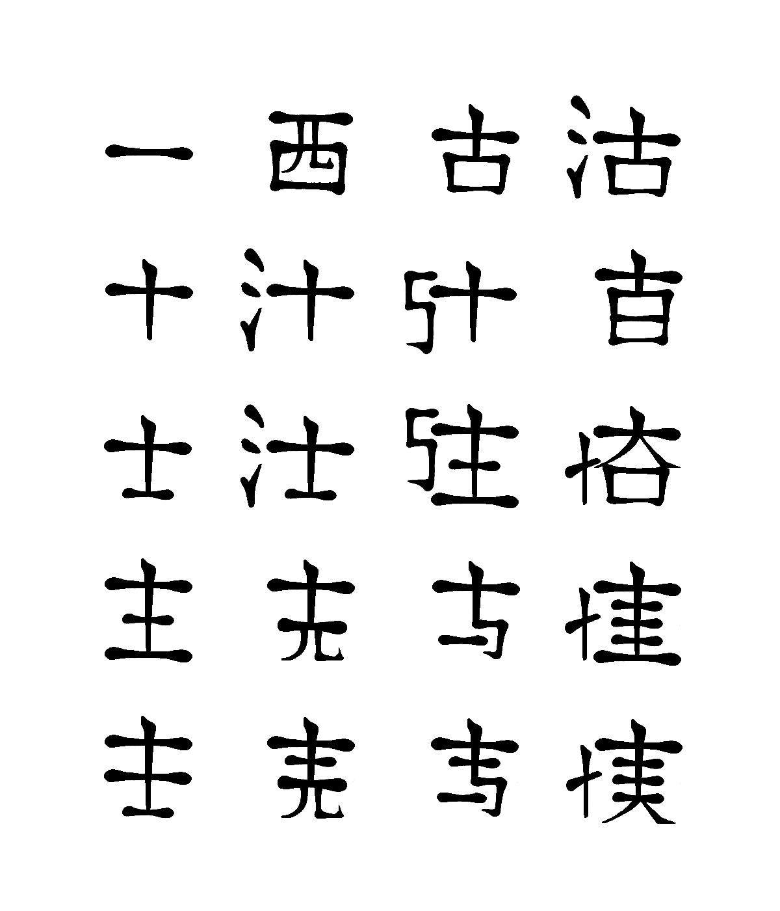

Twenty Characters
=================

*Representing amino acid sequences by an alphabet of pseudo-chinese characters*

This program creates images of protein primary structures using an amino acid alphabet inspired from Chinese calligraphy. The alternative one-letter-code. represents chemical properties like charges, aromaticity and chain size in the symbols. This may help you to spot chemical similarities easier than with the latin characters commonly used.

Disclaimer
---------
**You won't find most of the characters in the Twenty Characters font in a Chinese dictionary.** I would like to apologize for any pejorative language that the program may accidentally produce. 

I created the Twenty Characters font as a fun meta-science project that I contributed to the ECCB Science & Art competition in 2008. The scientific usefulness is yet to be proven. If you like, give it a try!

Installation
-----------
The program requires Python Imaging Library (PIL), which can be installed on Ubuntu Linux by:

    sudo apt-get install python-imaging

Usage
-----
Open a console, go into the twenty_characters/ directory and type:

    python twenty_characters.py -i twc.fasta -a aa_images/small/ -o twc.png

The image file *twc.png* is generated from the text in *twc.fasta*.

Motivation
---------
Bioinformaticians compare the amino acid sequences of proteins to each other, to draw conclusions about their evolutionary history and function. For that purpose, the sequences are usually represented by the one-letter-code, where each of the twenty amino acids is written by one character from the latin alphabet. In my opinion, this representation is close to the worst possible.

The encoding of 12 amino acids is based on the first letters of their names (A for Alanine, C for Cysteine, furthermore G, H, I, L, M, P, S, T, V, and with good will also F). For the remaining amino acids have been assigned to the letters that were left over (D for Aspartate, E for Glutamate, furthermore K, N, Q, R, W, and Y). Their chemical properties play no role in the code.

Therefore, the brain needs to identify chemically similar amino acids (like Phenylalanine/Tyrosine (F/Y) , Serine/Threonine (S/T), or Lysine/Arginine
(K/R)) by the semantics that are behind the names. Even worse, optically similar characters (like Glutamate/Phenylalanine (E/F), Methionine/Asparagine (M/N), and Proline/Arginine (P/R)) convey zero chemical information. On top of it, the amino acid names itself are rather descriptive of how an amino acid was discovered than of its chemical properties.

A dedicated bioinformatician can train his eyes to some extent. Unexperienced and busy ones have to undergo a daunting task when inspecting protein sequences. Often, software like BioEdit or StraP is applied to color or underline particular chemical features. This allows to highlight two or three features simultaneously at max. There has been evidence that the limits of human awareness slow down the recognition process severely when more than one color-feature pair is involved (Huang 2007) - Anybody who tried reading a newspaper where every word is written in a different color will confirm that.

 As a consequence, there is a huge burden on the visual cortex to make
sense of a protein sequence alignment, and it is unnecessarily difficult. With the visual cortex being known as a very powerful device for recognizing patterns, the situation can simply be considered a tremendous waste of our built-in computing power.

Reference
--------
Read the [**Twenty Characters**](http://academis.sites.djangoeurope.com/media/uploaded/TwentyCharacters_20110705.pdf) booklet with more molecules converted to chinese calligraphies.

Contributors
-----------
Kristian Rother (concept & design)
Cristian Hoof (implementation)
Käthe Wenzel (mentor)

Copyright
--------
This work is distributed under the conditions of the GPL.
(c) 2008 Kristian Rother

